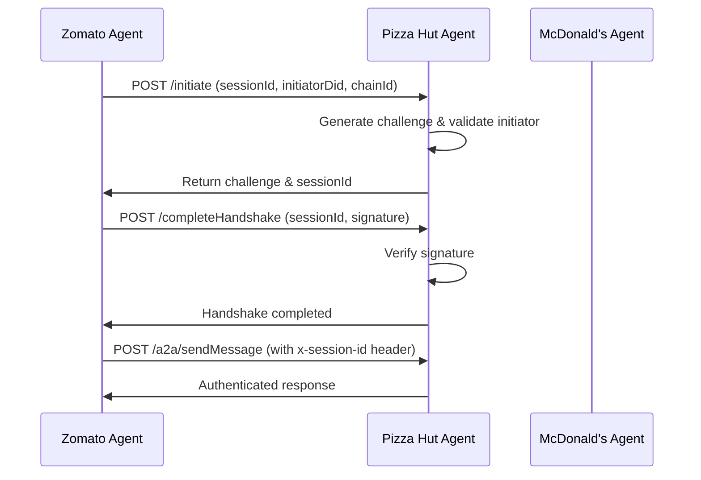

# 🍽️ Multi-Agent Food Delivery Ecosystem

A comprehensive A2A (Agent-to-Agent) compatible food delivery ecosystem built with LangChain and Hedera blockchain integration. This project features three specialized agents that can work together to provide complete food delivery services while maintaining secure transactions through the Hedera network.

## 🚀 Agents Overview

### 🍕 Zomato Agent (Port 3000)

**General Food Delivery Agent**

- Restaurant discovery and search
- Menu browsing and item details
- Order placement and tracking
- Multi-cuisine support
- Location-based recommendations

### 🍕 Pizza Hut Agent (Port 3001)

**Pizza Customization & Loyalty Agent**

- Custom pizza creation with unlimited combinations
- Loyalty program with tier-based benefits
- Promotional code management
- Pizza size, crust, sauce, and topping options
- Advanced pricing with HBAR

### 🍟 McDonald's Agent (Port 3002)

**Fast Food & Drive-Thru Agent**

- Combo meal creation and management
- Drive-thru slot reservations
- Detailed nutritional information
- McDelivery rewards program
- Real-time wait time management

## 🛠️ Tech Stack

- **Language**: TypeScript/JavaScript
- **Framework**: Express.js
- **AI/LLM**: LangChain with OpenAI GPT-4
- **Blockchain**: Hedera Hashgraph SDK
- **Protocol**: A2A (Agent-to-Agent) Protocol v0.3.0
- **Pricing**: HBAR (Hedera cryptocurrency)

## 📦 Installation

### Prerequisites

- Node.js 18+
- npm or yarn
- Hedera account with testnet access
- OpenAI API key

### Setup

1. **Clone the repository**

   ```bash
   git clone <repository-url>
   cd hedera-agent
   ```

2. **Install dependencies for all agents**

   ```bash
   # Zomato Agent
   cd zomato && npm install

   # Pizza Hut Agent
   cd ../pizzahut && npm install

   # McDonald's Agent
   cd ../mcdonalds && npm install
   ```

3. **Set up environment variables**
   Create `.env` files in each agent directory:
   ```env
   HEDERA_ACCOUNT_ID=your_hedera_account_id
   HEDERA_PRIVATE_KEY=your_hedera_private_key
   OPENAI_API_KEY=your_openai_api_key
   PORT=3000  # or 3001, 3002
   AGENT_URL=http://localhost:3000  # or 3001, 3002
   ```

## 🚀 Usage

### Start All Agents

```bash
# Terminal 1 - Zomato Agent
cd zomato && npm run dev

# Terminal 2 - Pizza Hut Agent
cd pizzahut && npm run dev

# Terminal 3 - McDonald's Agent
cd mcdonalds && npm run dev
```

## 🤝 A2A Handshake Protocol

This ecosystem implements a secure handshake protocol that allows agents to authenticate and establish trusted communication channels. The handshake system ensures that only verified agents can communicate with each other.

### Handshake Flow

1. **Zomato Agent** initiates handshakes with Pizza Hut and McDonald's agents
2. **Target Agents** (Pizza Hut/McDonald's) validate the initiator and generate challenges
3. **Zomato Agent** signs the challenge and completes the handshake
4. **Session-based communication** using shared session IDs for authenticated requests

### Handshake Endpoints

```bash
# Handshake Initiation (Pizza Hut & McDonald's)
POST http://localhost:3001/initiate
POST http://localhost:3002/initiate

# Handshake Completion (Pizza Hut & McDonald's)
POST http://localhost:3001/completeHandshake
POST http://localhost:3002/completeHandshake

# Zomato Handshake Orchestration
POST http://localhost:3000/initiateHandshake
```

### Session Security

- **Session Validation**: All `/a2a/sendMessage` requests to Pizza Hut and McDonald's require `x-session-id` header
- **Zomato Client-facing**: Zomato's `/a2a/sendMessage` remains client-accessible without session requirements
- **In-memory Storage**: Sessions are stored in memory with verification status
- **Cryptographic Signatures**: All handshakes use Hedera-based signature verification

## 🌐 A2A Protocol Endpoints

Each agent provides the following A2A-compliant endpoints:

### Health Check

```bash
GET http://localhost:3000/health  # Zomato
GET http://localhost:3001/health  # Pizza Hut
GET http://localhost:3002/health  # McDonald's
```

### Agent Cards

```bash
GET http://localhost:3000/.well-known/agent-card.json
GET http://localhost:3001/.well-known/agent-card.json
GET http://localhost:3002/.well-known/agent-card.json
```

### Message Endpoints

```bash
# REST API
POST http://localhost:3000/message
POST http://localhost:3001/message
POST http://localhost:3002/message

# A2A Protocol (Session-protected for Pizza Hut & McDonald's)
POST http://localhost:3000/a2a/sendMessage  # Client-facing
POST http://localhost:3001/a2a/sendMessage  # Requires x-session-id
POST http://localhost:3002/a2a/sendMessage  # Requires x-session-id

# A2A Streaming (Session-protected for Pizza Hut & McDonald's)
POST http://localhost:3000/a2a/sendMessageStream  # Client-facing
POST http://localhost:3001/a2a/sendMessageStream  # Requires x-session-id
POST http://localhost:3002/a2a/sendMessageStream  # Requires x-session-id
```

## 💰 HBAR Pricing System

All agents use HBAR (Hedera cryptocurrency) for pricing:

### Zomato Agent

- **Restaurant Items**: 0.6-1.2 HBAR
- **Delivery Fees**: 0.06-0.12 HBAR
- **Minimum Orders**: 0.6-1.2 HBAR

### Pizza Hut Agent

- **Base Pizza**: 1 HBAR (small) to 2 HBAR (extra large)
- **Toppings**: 0.15-0.25 HBAR each
- **Crust Upgrades**: 0-0.3 HBAR
- **Loyalty Multipliers**: 1.0x to 1.5x

### McDonald's Agent

- **Combo Meals**: 1.0-1.4 HBAR
- **Individual Items**: 0.3-1.0 HBAR
- **Drive-Thru**: No additional fees
- **McDelivery Rewards**: Points-based system

## 🔧 Agent Capabilities

### Zomato Agent Tools

- `search_restaurants` - Find restaurants by location and filters
- `get_restaurant_details` - Get detailed restaurant information
- `get_restaurant_menu` - Browse restaurant menus
- `get_menu_item_details` - Get item information
- `place_order` - Place food orders
- `get_order_status` - Track order status
- `pizza_hut_integration` - Communicate with Pizza Hut agent (with handshake)
- `mcdonalds_integration` - Communicate with McDonald's agent (with handshake)

### Pizza Hut Agent Tools

- `create_custom_pizza` - Build custom pizzas
- `get_pizza_sizes` - Get pizza size options
- `get_pizza_toppings` - Browse toppings
- `get_loyalty_points` - Check loyalty status
- `earn_loyalty_points` - Add loyalty points
- `validate_promo_code` - Apply promotional codes

### McDonald's Agent Tools

- `get_combo_meals` - Browse combo meals
- `create_custom_combo` - Build custom combos
- `get_nutritional_info` - Get nutritional data
- `get_available_drive_thru_slots` - Find drive-thru slots
- `reserve_drive_thru_slot` - Reserve pickup slots
- `get_mc_delivery_points` - Check rewards points

## 🔐 Hedera Plugin Integration

The system uses a custom Hedera plugin (`@zkred/hedera-agentid-plugin`) for secure agent-to-agent communication:

### Plugin Tools

- `generate_agent_did` - Generate decentralized identifiers for agents
- `validate_agent` - Validate agent credentials and DID
- `initiate_agent_handshake` - Start secure handshake process
- `complete_agent_handshake` - Complete handshake with signature verification
- `verify_signature` - Verify cryptographic signatures

### Integration Architecture

```
Zomato Agent (Client-facing)
    ↓ Handshake Protocol
Pizza Hut Agent (Session-protected)
    ↓ Handshake Protocol
McDonald's Agent (Session-protected)
```

### Security Features

- **DID-based Authentication**: Each agent has a unique decentralized identifier
- **Cryptographic Signatures**: All handshakes use Hedera-based signature verification
- **Session Management**: In-memory session storage with verification status
- **Challenge-Response**: Secure challenge generation and signature verification
- **Chain Validation**: Agent validation against Hedera network

## 🚀 Handshake Implementation

### How It Works

1. **Zomato Agent** uses integration tools to communicate with Pizza Hut and McDonald's
2. **Automatic Handshake**: Each integration tool automatically initiates and completes handshakes
3. **Session-based Communication**: Subsequent messages use session IDs for authentication
4. **Secure Validation**: All agents validate each other using Hedera DIDs and signatures

### Example Usage

```typescript
// Zomato agent automatically handles handshake when using integration tools
const pizzaHutResponse = await pizzaHutIntegrationTool.execute({
  message: "Show me your pizza menu",
});

const mcdonaldsResponse = await mcdonaldsIntegrationTool.execute({
  message: "What combo meals do you have?",
});
```

### Handshake Flow Details



### Environment Variables

Each agent requires specific environment variables for handshake functionality:

```env
# Required for all agents
HEDERA_PRIVATE_KEY=0x...  # Private key for signature generation
HEDERA_ACCOUNT_ID=0.0.123456  # Hedera account ID
OPENAI_API_KEY=sk-...  # OpenAI API key

# Agent-specific
PORT=3000  # Agent port
AGENT_URL=http://localhost:3000  # Agent URL
```

### Session Security Model

- **Zomato Agent**: Client-facing, no session requirements for incoming requests
- **Pizza Hut Agent**: Session-protected, requires `x-session-id` header for all `/a2a/sendMessage` requests
- **McDonald's Agent**: Session-protected, requires `x-session-id` header for all `/a2a/sendMessage` requests

This ensures that only authenticated agents can communicate with Pizza Hut and McDonald's, while Zomato remains accessible to clients.
